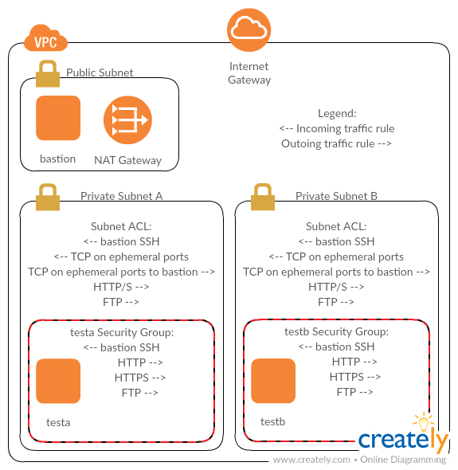

# About

A terraform module that deploys a nothing-out-of-box VPC. The VPC and its resources only implement what's needed to make SSH work and to allow you to install system packages.

This is primarily a demonstration where you can more easily see what rules/routes/etc. are really needed for traffic flows (because everything is disabled or blocked until you specifically enable it). It's not designed to be run directly in production.

This is primarily designed for you to run tests between the two private subnets.

Need help with this? I'm also [available to consult][consult].



# User Guide

For example:

```
module "minimal_vpc" {
  source = "git::https://github.com/operatingops/minimal_vpc.git?ref=master"

  aws_region = "us-west-2"
  enabled    = true
  key_name   = "adam"

  # terraform-null-label inputs
  namespace = "minimalvpc"
  stage     = "dev-1"
}
```

If you get errors, wait a minute and retry applying. It may take a bit for newly created or deleted resources in AWS to sync through the backend.

To de-provision the EC2 instances and NAT Gateways, without deleting any of the network infrastructure, set:

```enabled = false```

This uses cloudposse's [terraform-null-label](https://github.com/cloudposse/terraform-null-label/tree/0.5.3) to generate resource names and tags, and it accepts the same variables.

[consult]: https://operatingops.org/hire-adam/
